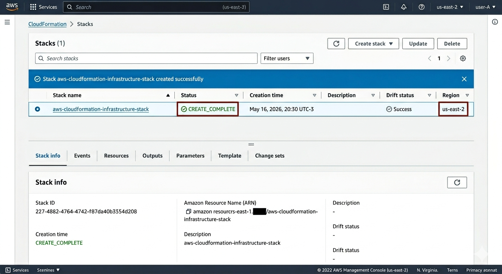

# Implementando Infraestrutura Automatizada com AWS CloudFormation

## 📋 Sobre o Desafio
Este repositório foi criado para documentar a resolução do desafio prático da Digital Innovation One (DIO), cujo objetivo é explorar os conceitos de **Infraestrutura como Código (IaC)** utilizando o **AWS CloudFormation**. A automação de infraestrutura permite provisionar, configurar e gerenciar recursos na AWS de forma padronizada, segura e replicável através de arquivos de configuração (templates).

---

## 🛠️ Tecnologias e Conceitos Explorados

*   **AWS CloudFormation:** Serviço nativo que ajuda a modelar e configurar seus recursos da Amazon Web Services de maneira automatizada.
*   **Infraestrutura como Código (IaC):** Prática DevOps de gerenciar e provisionar a infraestrutura por meio de arquivos de definição legíveis por máquina, eliminando configurações manuais.
*   **Formatos suportados:** Utilização de **YAML** ou **JSON** para a criação de modelos (*templates*).
*   **Conceito de Stacks:** Pilhas de recursos que podem ser criadas, atualizadas ou excluídas de forma atômica e coordenada pela AWS.

---

## 💡 Insights e Aprendizados Adquiridos

### 1. CloudFormation vs. Terraform
Durante o desenvolvimento do laboratório, ficou evidente a diferença crucial entre as ferramentas de IaC:
*   **AWS CloudFormation:** É uma ferramenta proprietária e nativa da AWS. Oferece excelente integração com o ecossistema da Amazon, possui gerenciamento de estado automatizado pela própria AWS e não há custos adicionais pelo uso do motor de provisionamento.
*   **Terraform:** É uma ferramenta *open-source* e agnóstica de nuvem (multicloud), criada pela HashiCorp. Utiliza a linguagem HCL e exige que o desenvolvedor gerencie o arquivo de estado (`terraform.tfstate`).

### 2. Benefícios da Automação com IaC
*   **Padronização:** Elimina o erro humano que ocorre frequentemente em configurações manuais feitas diretamente via Console AWS.
*   **Replicação Eficiente:** Capacidade de duplicar ambientes inteiros (Desenvolvimento, Homologação e Produção) em poucos minutos, alterando apenas parâmetros simples no template.
*   **Rastreabilidade:** Os templates de infraestrutura são versionados no Git, permitindo auditoria completa de quais modificações foram feitas e por quem.

---

## 📸 Evidência de Execução

Abaixo está a demonstração do sucesso no provisionamento dos recursos através do painel do serviço na AWS, exibindo o status de criação concluída com sucesso (`CREATE_COMPLETE`):

---

## 🚀 Como Executar este Projeto

 1. Acesse o Console de Gerenciamento da AWS.
 2. Navegue até o serviço **CloudFormation**.
 3. Clique em **Create stack** (Com novos recursos).
 4. Selecione "Template is ready" e faça o upload do arquivo contido na pasta /templates deste repositório.
 5. Avance nas etapas preenchendo os parâmetros necessários (como o tipo de ambiente dev ou prod) e clique em **Submit**
